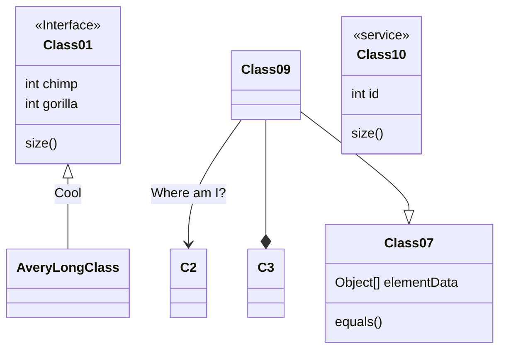

<!--### Hi there 👋-->

<!--
**rafaelcetina/rafaelcetina** is a ✨ _special_ ✨ repository because its `README.md` (this file) appears on your GitHub profile.

Here are some ideas to get you started:

- 🔭 I’m currently working on ...
- 🌱 I’m currently learning ...
- 👯 I’m looking to collaborate on ...
- 🤔 I’m looking for help with ...
- 💬 Ask me about ...
- 📫 How to reach me: ...
- 😄 Pronouns: ...
- ⚡ Fun fact: ...
-->


## I'm RODOLFO RAFAEL DZUL CETINA 👋
## Full-Stack Developer 👨‍💻

[](https://www.linkedin.com/in/rodolfo-dzul/)
[](mailto:rafaelcetina07@gmail.com)
[](https://twitter.com/CetinaRafael)


<br/>
[](https://github.com/rafaelcetina/github-readme-stats)


###  A little more about me...  




```javascript

const rafaelcetina = {
    askMeAbout: ["app dev", "web dev", "tech"],
    technologies:{
        backEnd: ["nodejs", "express", "php"],
        protocols: ["rest", "http", "graphql", "serverless"],
        fronEnd: {
          skills: ["react", "vue", "web development", "mobile development", "frontend"],
          cssMethodologies: ["bem"],
          frameworks: ["react", "gatsby", "redux", "vue", "nuxt"],
          libraries: ["bootstrap", "materialize"],
          design: ["adobe Photoshop"]
        },
        mobileApp: ["react-native"],
        database: ["mongodb","MySQL"],
        devOps: ["digitalOcean", "nginx", "apache", "hostinger", "heroku", "ngrok", "netlify"],
        misc: ["socket.IO"],
        otherLanguages: ["typescript", "c#", "java"]
    },
    architecture: ["microservices", "spa"]
}

⚡ console.log(rafaelcetina);
```
